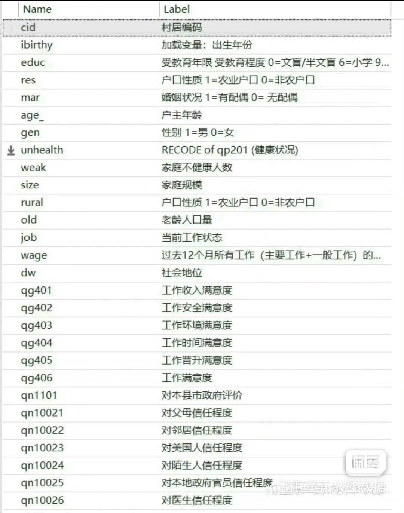
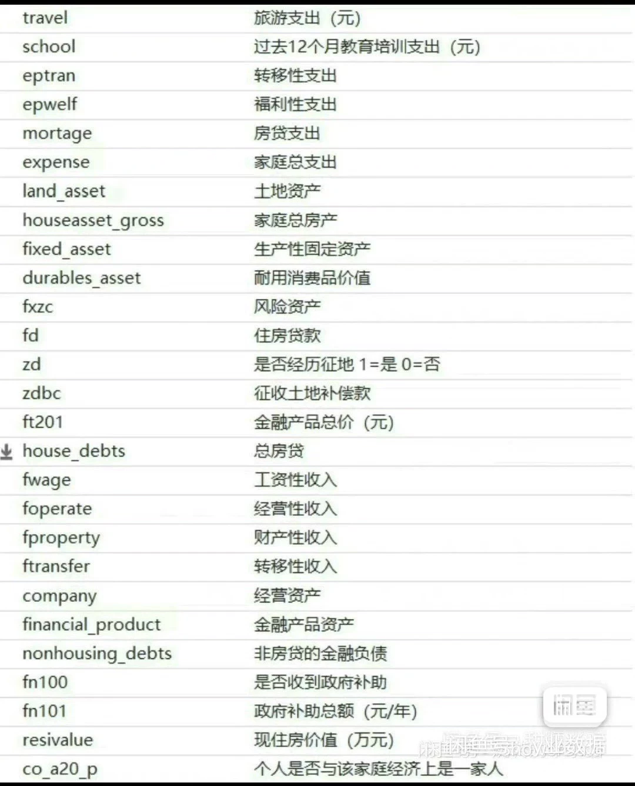
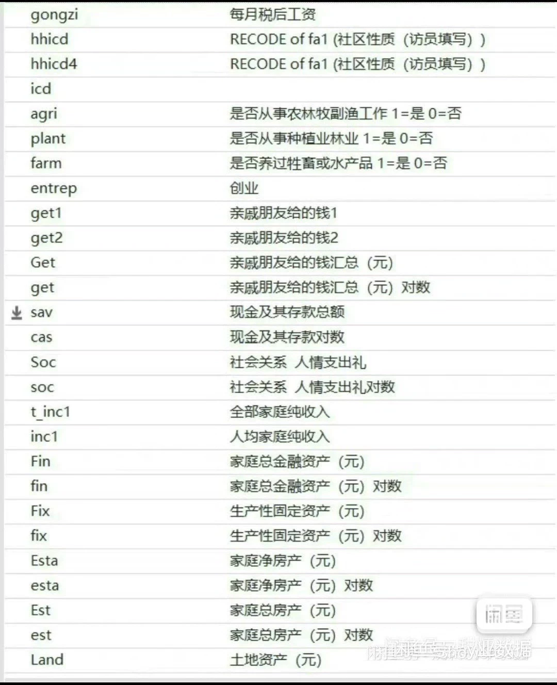
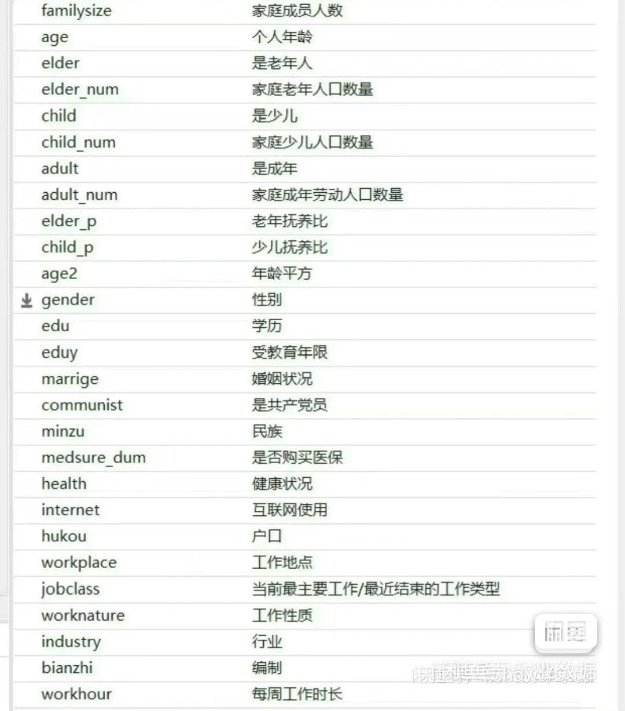
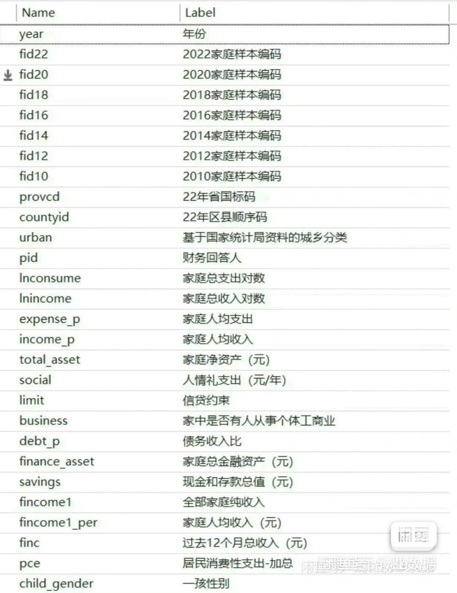
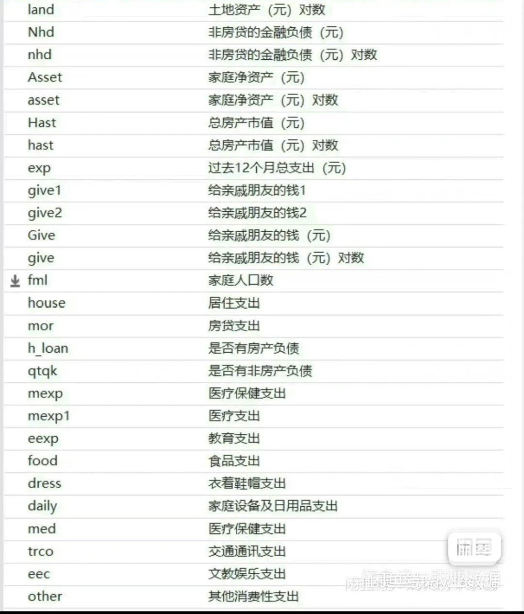

## Body

The panel data cleaned from 2010 to 2022, including 190+ total variables and over 3400 lines of cleaning code. It can directly run regressions and reproduce results.

The main variables are as shown in the image below, with both balanced and unbalanced panel datasets (both available in Stata and Excel formats), raw data, codes, county-level matching codes, and separate county sequence codes that can be matched to the municipal level. The cleaning code exceeds 3500 lines, which can be directly reproduced.

## Images

Here is a pay link on Stripe ( https://buy.stripe.com/3cs8yP7sY87d0vu9AB ). Please contact me lonlonago@foxmail.com after funding $89, and I will send you a complete data files , thank you!

